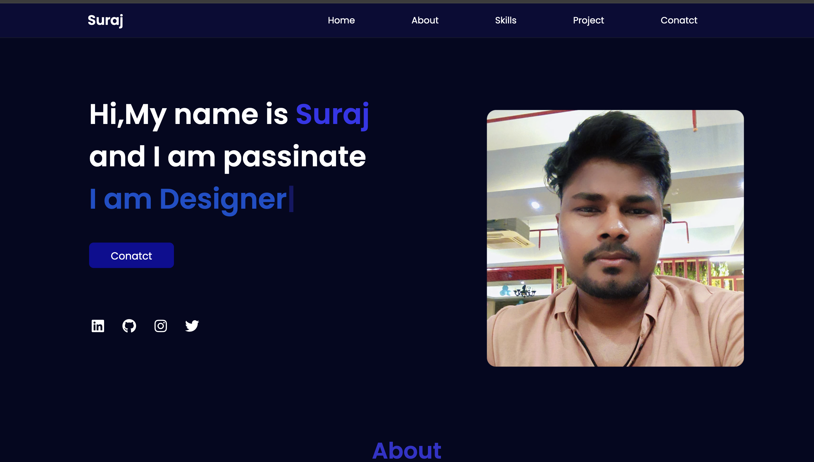
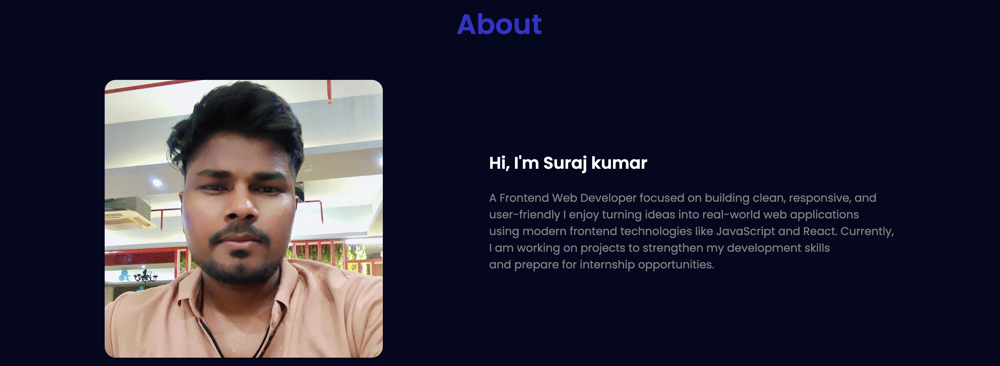
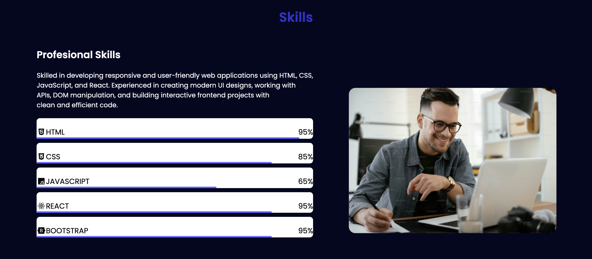
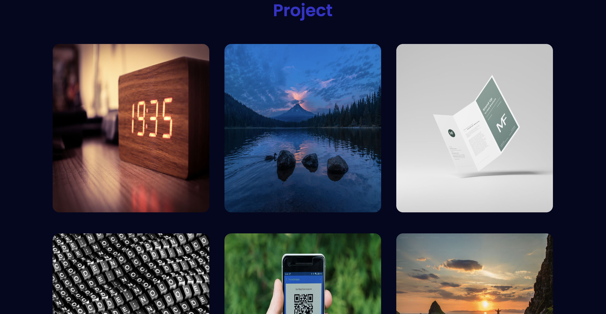
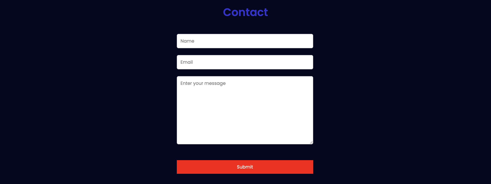

# 🌐 Personal Portfolio Website

A modern and responsive personal portfolio website built using HTML, CSS, and JavaScript to showcase my projects, skills, and frontend development experience.

---

## 🚀 Features

- Responsive design for all devices
- Modern UI and smooth animations
- About Me section
- Skills section
- Projects showcase
- Contact section
- Social media links
- Smooth scrolling navigation

---

## 🛠 Tech Stack

- HTML5
- CSS3
- JavaScript
- Responsive Design
- Flexbox & Grid

---

## 📂 Projects Included

- 🌦 Weather App
- 🎬 Advance Digital Clock
- 🧮 Responsive Project
- 📋 Rnadom Password generator
- ▶️ Temprature Converter

---

## 🌐 Live Demo

https://app.netlify.com/projects/suraj-portfol/overview
---

## 📸 Screenshot

---

## 📫 Contact

- GitHub: https://github.com/Suraj1234-wq
- LinkedIn: https://www.linkedin.com/in/suraj-kumar-7a104032b/
- Email: ksurajkumar336@gmail.com

---

## 💡 Purpose

This portfolio was created to showcase my frontend development skills, projects, and practical experience for internship and placement opportunities.